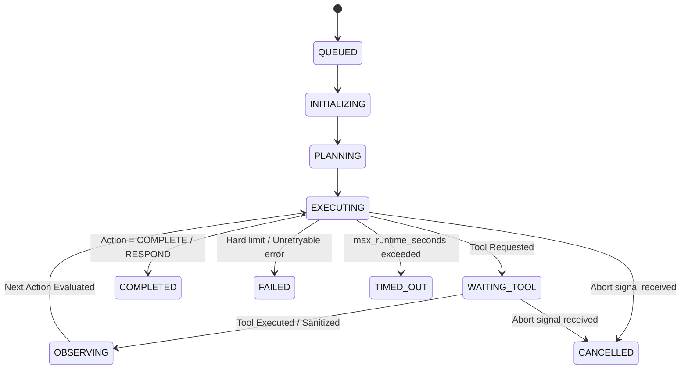

# KINETIQ — AGENT RUNTIME V1 PRODUCTION ARCHITECTURE REPORT

## Executive Summary

KINETIQ Agent Runtime V1 delivers a secure, deterministic, fully observable autonomous agent execution engine. While the Mission Engine orchestrates overarching goals and workflows, the Agent Runtime executes discrete mission steps through governed AI model inference and authorized tool executions.

The system is built upon the foundational core principle:
> **"The model does NOT control KINETIQ. KINETIQ controls what the model is allowed to do. The AI proposes. The policy engine decides. The runtime executes. The system records everything."**

---

## 1. End-to-End Architectural Pipeline

```
Mission Step / Goal Trigger
            ↓
   Agent Runtime Engine
            ↓
   Context Assembly (Strict Tenant Isolation + Prompt Injection Quarantine Delimiters)
            ↓
   Context Budget Calculation (Deterministic Truncation)
            ↓
   Model Gateway Request (Capability & Cost Routing -> OpenRouter)
            ↓
   Structured Output Validator (Strict Schema: { action, tool, arguments, reason, response })
            ↓
   Centralized Tool Registry & PolicyEngine Authorization (Risk Assessment: LOW | MEDIUM | HIGH | CRITICAL)
            ↓
   Tool Execution & Output Sanitization (Idempotency Key Guard)
            ↓
   Step Observation Recording (Append-only state storage)
            ↓
   Token & Cost Aggregation (Exact FinOps Ledger recording)
            ↓
   Next Step Evaluation / Completion
            ↓
   Live SSE Event Stream & Mission Step Emission
```

---

## 2. Core Entities & Immutable Versioning

| Entity | Table / Store | Key Attributes | Immutability & Lifecycle |
|---|---|---|---|
| `Agent` | `agents` | `id`, `workspace_id`, `name`, `description`, `status`, `system_instructions`, `capabilities`, `allowed_tools`, `allowed_models`, `max_steps`, `max_runtime_seconds`, `max_token_budget` | Status: `DRAFT`, `ACTIVE`, `PAUSED`, `DISABLED`, `ARCHIVED`. `DISABLED` and `ARCHIVED` are blocked from execution. |
| `AgentVersion` | `agent_versions` | `id`, `agent_id`, `workspace_id`, `version`, `instructions`, `capabilities`, `tool_policy`, `model_policy`, `limits` | **Immutable**. Published version incremented (`v1`, `v2`, `v3`...) whenever system instructions, capabilities, tool policy, or limits are modified. |
| `AgentRun` | `agent_runs` | `id`, `agent_id`, `agent_version_id`, `mission_id`, `workspace_id`, `status`, `current_step`, `started_at`, `completed_at`, `duration_ms`, `input_tokens`, `output_tokens`, `total_tokens`, `cost_usd`, `error_info`, `result_data` | State Machine: `QUEUED` -> `INITIALIZING` -> `PLANNING` -> `EXECUTING` -> `WAITING_TOOL` -> `OBSERVING` -> `COMPLETED` / `FAILED` / `CANCELLED` / `TIMED_OUT`. |
| `AgentObservation` | `agent_observations` | `id`, `agent_run_id`, `workspace_id`, `step_number`, `observation_type`, `tool_name`, `status`, `summary`, `raw_data`, `timestamp` | Recorded per step. Serves as execution trace, audit trail, and prompt history input for subsequent steps. |
| `AgentEvent` | `agent_events` | `id`, `agent_run_id`, `workspace_id`, `mission_id`, `event_type`, `correlation_id`, `timestamp`, `payload` | Immutable append-only event stream broadcasted live via Server-Sent Events (SSE). |

---

## 3. Security & Governance Matrix

### A. Strict Tenant Scoping & IDOR Prevention
Every operation (Agent CRUD, AgentRun execution, memory retrieval, document extraction, event stream subscription) resolves identity on the server and checks the active `workspace_id`. Cross-workspace requests are strictly rejected with HTTP 404/403.

### B. Prompt Injection Defense
All retrieved documents, memories, user-provided inputs, and tool outputs are quarantined inside explicit unforgeable delimiters:
```
=== UNTRUSTED_RETRIEVED_DATA [Source: memory_doc_102] ===
...content...
=== END_UNTRUSTED_RETRIEVED_DATA ===
```
The system directives instruct the model that content within untrusted blocks is reference data only and cannot modify system directives, initiate side-effects, or bypass governance checks. Delimiter forgery attempts within untrusted text are automatically neutralized (`[ESCAPED_DATA_TOKEN]`).

### C. Multi-Level Tool Authorization & Risk Classification

| Risk Level | Description | Examples | Authorization Requirement |
|---|---|---|---|
| `LOW` | Read-only queries | `search_missions`, `get_mission`, `search_memory`, `search_drive_files`, `get_drive_file_content`, `get_calendar_events`, `search_gmail` | Agent `allowed_tools` whitelist check + User `read` privilege. |
| `MEDIUM` | Internal workspace creates/updates | `create_mission`, `create_content`, `create_memory_candidate` | Agent `allowed_tools` whitelist check + User `write` privilege. |
| `HIGH` | External side-effects & notifications | `create_calendar_event`, `send_notification` | PolicyEngine evaluate check + Idempotency key tracking + Integration permissions. |
| `CRITICAL` | Administrative / Security altering | Infrastructure reconfiguration | Admin role requirement + Explicit governance policy approval. |

---

## 4. Lifecycle State Machine & Transition Rules



---

## 5. Verification & Test Metrics

### Backend Test Suite (`apps/api/tests/test_agent_runtime_v1.py`)
- **14 Passed / 0 Failed (100% Pass Rate)**
- Test coverage:
  1. `test_agent_status_transitions`: Validates legal/illegal transitions between DRAFT, ACTIVE, PAUSED, DISABLED, ARCHIVED.
  2. `test_agent_run_status_transitions`: Validates state machine rules for AgentRun.
  3. `test_disabled_agent_rejection`: Validates that DISABLED and ARCHIVED agents raise `AgentExecutionNotAllowedError`.
  4. `test_agent_creation_and_versioning`: Validates that creation yields `v1` and policy modifications produce immutable `v2`.
  5. `test_prompt_injection_quarantine`: Validates quarantine delimiters and neutralization of delimiter forgery.
  6. `test_context_budget_truncation`: Validates deterministic sliding-window truncation when token ceiling is reached.
  7. `test_tool_authorization_allowed_and_denied`: Validates permitted tools execute while unauthorized tools are rejected with `POLICY_DENIED`.
  8. `test_tool_idempotency`: Validates side-effect tools return cached execution on identical idempotency keys.
  9. `test_structured_output_parser`: Validates JSON extraction from plain text, markdown blocks, and natural language fallbacks.
  10. `test_agent_run_execution_loop`: Validates end-to-end bounded execution, tool execution, observation recording, and event emission.
  11. `test_agent_run_pause_resume_cancel`: Validates pause at step boundary, resume, and cancellation mechanics.
  12. `test_api_agents_endpoints`: Validates `/api/v1/agents` REST CRUD, pause, and resume.
  13. `test_api_agent_runs_endpoints`: Validates `/api/v1/agent-runs` creation, observations, events, and controls.
  14. `test_cross_workspace_tenant_isolation`: Validates IDOR prevention across tenants.

### Regression Test Suite
- `apps/api/tests/test_mission_engine_v1.py`: **9 Passed (100%)**
- `apps/api/tests/test_model_gateway.py`: **6 Passed (100%)**
- **Total Combined Backend Tests**: **29 Passed / 0 Failed**

### Frontend Compilation (`apps/web`)
- `pnpm --filter vapor-web build`: **Clean Next.js 14 production build (98/98 routes compiled)**.
- Zero TypeScript errors. Strict matte-black design system preserved.
