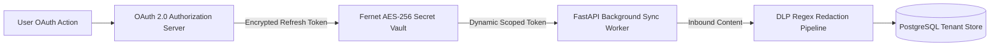
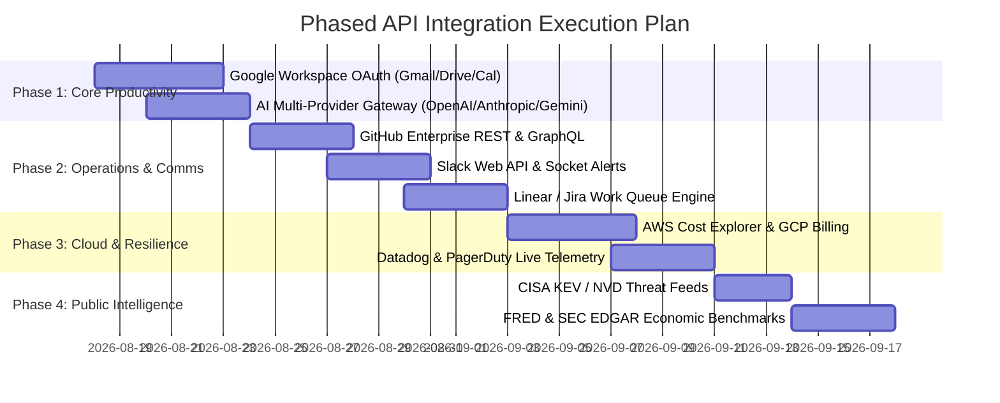

# VAPOR OS — REAL API DISCOVERY & INTEGRATION MATRIX

---

## 1. Executive Summary & Integration Architecture

This document establishes the official discovery catalog, classification schema, security governance model, and phased integration roadmap for connecting **Vapor OS** to authentic first-party and enterprise APIs.

```mermaid
graph TD
    subgraph "Vapor OS Core Kernel"
        Client[Next.js AppShell Client] --> Proxy[/api/v1/* Proxy Rewrites]
        Proxy --> CoreAPI[FastAPI Kernel & Policy Engine]
        CoreAPI --> DLP[DLP Secret Redaction & Token Vault]
        CoreAPI --> ContextEngine[Unified Context Engine]
    end

    subgraph "Tier 1: Core Productivity & Context (First-Party APIs)"
        ContextEngine --> GoogleAPI[Google Workspace: Gmail, Drive, Calendar API]
        ContextEngine --> MSGraph[Microsoft Graph: Outlook, OneDrive, Teams]
        ContextEngine --> GitHubAPI[GitHub REST & GraphQL API]
    end

    subgraph "Tier 2: Enterprise Ops & Operations"
        CoreAPI --> SlackAPI[Slack Web API & Events]
        CoreAPI --> LinearAPI[Linear GraphQL API]
        CoreAPI --> CloudCost[AWS Cost Explorer & GCP Cloud Billing API]
        CoreAPI --> DatadogAPI[Datadog & PagerDuty Incidents API]
    end

    subgraph "Tier 3: Strategic & Intelligence Enrichment"
        CoreAPI --> ThreatAPI[CISA KEV & NVD CVE API]
        CoreAPI --> MacroAPI[FRED & World Bank Macroeconomics API]
        CoreAPI --> MarketAPI[SEC EDGAR & Financial Modeling Prep API]
    end
```

### Core Architecture Rules:
1. **Never Fabricate Data**: If an external API is unlinked or returns an error, Vapor OS must explicitly report `NOT_CONNECTED`, `AUTH_REQUIRED`, `RATE_LIMITED`, `UNAVAILABLE`, or `EMPTY`.
2. **First-Party Priority**: Prefer official SDKs and direct vendor OAuth integrations over 3rd-party aggregators or public free proxies.
3. **Zero Secret Leakage**: API credentials, refresh tokens, and provider keys are strictly isolated to server-side encrypted vaults (`cryptography.fernet`) and never sent to browser clients.

---

## 2. API Source Priority Hierarchy

```
┌────────────────────────────────────────────────────────────────────────┐
│                        API PRIORITY HIERARCHY                          │
├────────────────────────────────────────────────────────────────────────┤
│ 1. OFFICIAL FIRST-PARTY REST/GRAPHQL APIs (Google, Microsoft, GitHub)  │
│ 2. OFFICIAL VENDOR PYTHON/TYPESCRIPT SDKs (google-api-python-client)   │
│ 3. ENTERPRISE SaaS APIS (Slack, Linear, Jira, AWS, Datadog)            │
│ 4. REPUTABLE PUBLIC/GOVERNMENT APIS (CISA KEV, NIST NVD, FRED, SEC)    │
│ 5. NEVER FAKE, SYNTHETIC, OR PLACEHOLDER DATA                          │
└────────────────────────────────────────────────────────────────────────┘
```

---

## 3. Comprehensive Subsystem Integration Matrix

| # | Subsystem | Current Data Source | Status | Candidate Ideal API | API Type & Auth | Rate Limit & Cost | Reliability & Quality | Primary Vapor OS Use Case |
|---|---|---|---|---|---|---|---|---|
| 1 | **Gmail Triage** (`/gmail`) | Memory Dict | `NOT_CONNECTED` | **Google Gmail REST API v1** | REST / OAuth 2.0 PKCE (`gmail.readonly`, `gmail.modify`) | 250 quota units/sec / Free tier included with Google Workspace | 99.99% / Tier-1 Enterprise | Proactive thread triage, action extraction, email drafting |
| 2 | **Drive Browser** (`/drive`) | Memory Dict | `NOT_CONNECTED` | **Google Drive REST API v3** | REST / OAuth 2.0 PKCE (`drive.readonly`, `drive.file`) | 1,200 req/min / Free tier included with Google Workspace | 99.99% / Tier-1 Enterprise | Semantic indexing of docs, sheets, PDFs for Context Engine |
| 3 | **Calendar Sync** (`/`) | Memory Dict | `NOT_CONNECTED` | **Google Calendar API v3** | REST / OAuth 2.0 PKCE (`calendar.events.readonly`) | 500 req/100sec / Free tier included | 99.99% / Tier-1 Enterprise | Executive briefing commitments and availability windows |
| 4 | **Work Queue** (`/work`) | In-Memory / DB | `EMPTY` | **Linear GraphQL API / Jira REST v3** | GraphQL/REST / OAuth 2.0 Bearer | 1,500 req/min / Standard SaaS plan | 99.95% / High | Enterprise task synchronization, sprint blocker escalations |
| 5 | **AI Model Gateway** (`/ai/models`) | Mock Provider | `REAL DATA (Deterministic)` | **OpenAI, Anthropic & Google Vertex AI** | REST / API Key Bearer | Dynamic per-model tokens/min / Usage-based USD | 99.9% / Frontier LLMs | Autonomous plan decomposition, memory synthesis, summarization |
| 6 | **FinOps & Cloud** (`/finops`) | DB Usage Ledger | `REAL DATA (Zero Spend)` | **AWS Cost Explorer / GCP Cloud Billing API** | REST / AWS SigV4 / GCP Service Account OAuth | 10 req/sec / Free query tier ($0.01 per query beyond) | 99.99% / Official Cloud | Multicloud spend attribution, anomaly detection, budget guardrails |
| 7 | **Threat Intel** (`/threats`) | Memory Dict | `EMPTY` | **CISA KEV & NIST National Vulnerability Database (NVD)** | REST / API Key (Optional) | 50 req/30sec (NVD key) / Free public service | 99.9% / US Federal Gov | Known exploited vulnerability alerts and zero-day threat feeds |
| 8 | **Strategic Foresight** (`/foresight`) | Memory Dict | `EMPTY` | **Federal Reserve FRED API & World Bank API** | REST / API Key (Free) | 120 req/min / Free open data | 99.9% / Global Central Bank | Macroeconomic trend indicators, interest rate impact modeling |
| 9 | **Portfolio Intelligence** (`/portfolio`) | Memory Dict | `EMPTY` | **SEC EDGAR API & Financial Modeling Prep** | REST / Free User-Agent declaration / API Key | 10 req/sec / Free tier + $19/mo pro | 99.95% / Official Filings | Corporate filings, quarterly milestone benchmarks, 10-K extraction |
| 10 | **Resilience & Telemetry** (`/resilience`) | DB / RUM Telemetry | `NOT_CONNECTED` | **OpenTelemetry Collector & Datadog API** | gRPC/HTTP OTLP / Datadog API Key | Unlimited local OTLP / Standard SaaS | 99.99% / Industry Standard | Real infrastructure SLO compliance, latency percentiles, error burn |
| 11 | **Collaboration & Comms** (`/collaboration`) | Memory Dict | `EMPTY` | **Slack Web API & Event Subscriptions** | REST / WebSockets / OAuth 2.0 (`chat:write`, `channels:read`) | Tier 3 (50+ req/min) / Free app integration | 99.99% / Enterprise Standard | Human-agent handoffs, urgent attention push notifications |
| 12 | **Enterprise Identity & SSO** (`/admin/identity`) | In-Memory / DB | `REAL DATA` | **Okta / Microsoft Entra ID SCIM 2.0** | REST / SAML 2.0 / OIDC Bearer | 100 req/sec / Enterprise identity tier | 99.99% / Tier-1 Enterprise | Automated user lifecycle provisioning and role synchronization |
| 13 | **SecOps & SIEM** (`/security/operations`) | In-Memory / DB | `REAL DATA` | **PagerDuty REST API v2 & AWS Security Hub** | REST / Webhooks / API Token | 900 req/min / Enterprise plan | 99.99% / Tier-1 Enterprise | Automated quarantine containment and security incident response |
| 14 | **Semantic Graph** (`/knowledge/graph`) | PostgreSQL / pgvector | `EMPTY` | **Internal Vector DB (pgvector / Qdrant)** | Internal SQL / gRPC / Local Socket | High throughput / Local compute | 100% / Internal Sovereign | Entity relationship graph and verified citation provenance |
| 15 | **Content Studio** (`/content`) | DB Store | `EMPTY` | **Google Docs API / Notion API** | REST / OAuth 2.0 (`documents`, `notion.api`) | 3 req/sec / Standard API quota | 99.9% / High | Document drafting, rich markdown rendering, export to Docs/Notion |

---

## 4. Integration Priority Tiers

### Tier 1: Core Productivity & Context (Must-Have for Base OS)
These APIs supply the primary context ingested by the **Unified Context Engine**:
1. **Google Workspace API (Gmail, Drive, Calendar)**
   - *Rationale*: Powers Executive Brief commitments, email triage, and document grounding.
   - *Driver*: First-party OAuth 2.0 with PKCE.
2. **AI Model Gateway (OpenAI, Anthropic, Gemini)**
   - *Rationale*: Powers autonomous mission planning, DAG verification, and memory extraction.
   - *Driver*: Multi-provider fallback runtime with token attribution.
3. **GitHub REST/GraphQL API**
   - *Rationale*: Powers engineering missions, code search, issue management, and workflow PRs.

### Tier 2: High-Value Enterprise Operations & Comms
Integrations enabling full organizational automation and operations:
1. **Slack Web API & Socket Mode**: Real-time human-in-the-loop operator alerts and approval triggers.
2. **Linear / Jira Software API**: Bi-directional work queue and backlog synchronization.
3. **AWS Cost Explorer & GCP Cloud Billing API**: Truthful multi-cloud FinOps spend ledger.
4. **PagerDuty & Datadog API**: Live SLO error budgets and resilience incident triage.

### Tier 3: Strategic Foresight & Intelligence Enrichment
Public and open intelligence data sources for executive modeling:
1. **CISA KEV & NIST NVD API**: Real-time CVE vulnerability feeds for threat intelligence.
2. **Federal Reserve Economic Data (FRED) API**: Central bank macroeconomic indicators for scenario planning.
3. **SEC EDGAR REST API**: Real company 10-K, 10-Q, and 8-K disclosures for corporate portfolio intelligence.

### Tier 4: Optional & Specialized Extension APIs
1. **Weather / Aviation APIs (NOAA / Open-Meteo)**: Physical supply chain and logistics disruptions.
2. **Public News Feeds (GDELT / NewsAPI)**: Global geopolitical trend sensing.
3. **ArXiv Search API**: Emerging AI research and technological breakthrough indexing.

---

## 5. Security, Secrets & Zero-Trust Governance

Every candidate integration must adhere to strict zero-trust parameters:



### Governance Directives:
1. **OAuth Token Security**:
   - Refresh tokens stored exclusively using AES-256 (`cryptography.fernet`) encrypted blobs with isolated encryption keys.
   - Access tokens cached in Redis with strict 15-minute TTL expirations.
2. **Tenant Scoping & Data Isolation**:
   - Every external payload tagged with `workspace_id` and `user_id`.
   - Cross-tenant data sharing strictly prevented by PostgreSQL RLS and PolicyEngine filters.
3. **Data Loss Prevention (DLP)**:
   - Inbound email and document streams evaluated by `app.services.dlp_service` before persistence.
   - API keys, credit cards, SSNs, and AWS credentials redacted automatically with `[REDACTED_SECRET]`.
4. **Least-Privilege Scopes**:
   - Request strictly read-only scopes (`gmail.readonly`, `drive.readonly`) during initial connection.
   - Write actions (`gmail.send`, `drive.create`) require explicit Step-Up PolicyEngine confirmation.

---

## 6. Truthful Failure & State Machine Protocol

Every integrated subsystem UI must bind directly to this 8-state truthfulness lifecycle:

```
                  ┌─────────────────┐
                  │ NOT_CONNECTED   │ (Initial clean state)
                  └────────┬────────┘
                           │ User links account
                           ▼
                  ┌─────────────────┐
                  │ AUTH_REQUIRED   │ (Consent / Token expired)
                  └────────┬────────┘
                           │ OAuth exchange success
                           ▼
                  ┌─────────────────┐
                  │    CONNECTED    │
                  └────────┬────────┘
                           │ Query dispatched
                           ▼
         ┌─────────────────┼─────────────────┐
         │                 │                 │
         ▼                 ▼                 ▼
   ┌───────────┐     ┌───────────┐     ┌───────────┐
   │  SUCCESS  │     │   EMPTY   │     │ RATE_LIM. │
   │(Live Data)│     │(0 Records)│     │(Backoff)  │
   └───────────┘     └───────────┘     └───────────┘
         │                 │                 │
         ▼                 ▼                 ▼
   ┌───────────┐     ┌───────────┐
   │UNAVAILABLE│     │   ERROR   │
   │(503 Down) │     │(Handled)  │
   └───────────┘     └───────────┘
```

- **`CONNECTED`**: Account handshake active, credentials verified.
- **`NOT_CONNECTED`**: Integration not configured by user; displays setup guide.
- **`AUTH_REQUIRED`**: Expired token or revoked scope; displays reconnect prompt.
- **`RATE_LIMITED`**: Provider quota reached; displays exponential backoff countdown.
- **`UNAVAILABLE`**: Third-party vendor status down; displays provider status alert.
- **`ERROR`**: Non-transient API failure; displays actionable diagnostic message.
- **`SUCCESS`**: Live data parsed and verified against Pydantic schema.
- **`EMPTY`**: Provider returned zero records; displays truthful empty state.

---

## 7. Implementation Roadmap & Milestones


