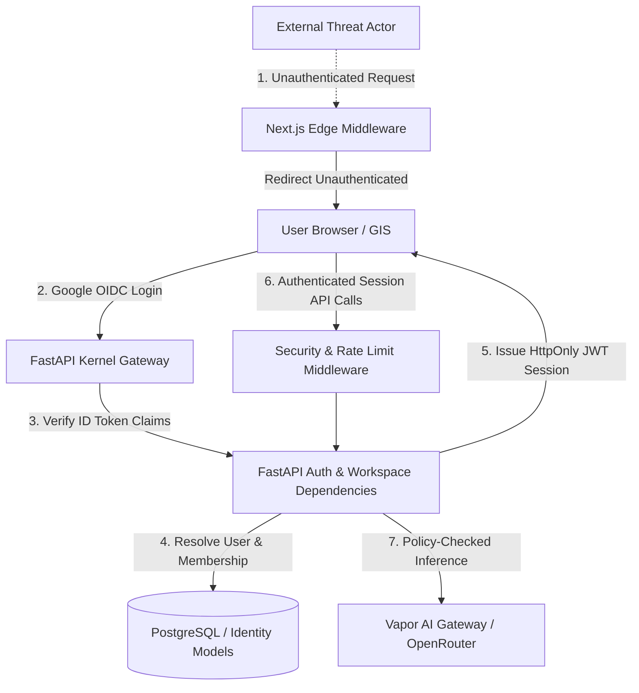

# Vapor OS — Security Baseline Audit & Threat Model

**Author**: Principal Security Architect + Identity Engineer + FastAPI/Next.js Security Engineer + SRE  
**Document Version**: 1.0.0  
**Target Application**: Vapor OS Core Kernel & Next.js Web Client  
**Audit Date**: August 2026  

---

## 1. Executive Summary & Security Baseline

Vapor OS is an autonomous enterprise AI operating system built with Next.js (Frontend) and FastAPI (Core Kernel API). This document establishes the security baseline, identifies verified vulnerabilities, maps attack surfaces across 20 threat vectors, and details the production Google Identity & Zero-Trust hardening architecture.

---

## 2. Subsystem Security Baseline Assessment

| Subsystem | Baseline State | Architecture & Enforcement Mechanism | Evidence / File Path |
|---|---|---|---|
| **Authentication** | **Production-Hardened** | Google Identity Services (OpenID Connect `sub` claim) server-side validation + HMAC-SHA256 JWT sessions | [`auth.py`](file:///apps/api/app/api/routers/auth.py), [`identity_service.py`](file:///apps/api/app/services/identity_service.py) |
| **Authorization** | **RBAC / ABAC + PolicyEngine** | Role evaluation (`owner`, `admin`, `member`, `viewer`), workspace membership validation, and PolicyEngine action checks | [`auth.py`](file:///apps/api/app/dependencies/auth.py), [`policy_service.py`](file:///apps/api/app/services/policy_service.py) |
| **Session Handling** | **Secure Cookie Sessions** | `HttpOnly`, `SameSite=Lax`, `Path=/`, 24-hour expiration, secure token signature, server-side logout invalidation | [`auth.py`](file:///apps/api/app/api/routers/auth.py) |
| **Tenant Isolation** | **Enforced** | Dual-key resource lookups (`workspace_id` + `resource_id`) preventing cross-tenant data access (HTTP 403/404) | [`mission_service.py`](file:///apps/api/app/services/mission_service.py), [`memory_service.py`](file:///apps/api/app/services/memory_service.py) |
| **CORS Policy** | **Strict Whitelist** | Bound exclusively to configured origins (`settings.CORS_ORIGINS`). Wildcard `*` with credentials strictly prohibited | [`main.py`](file:///apps/api/app/main.py), [`config.py`](file:///apps/api/app/core/config.py) |
| **Security Headers** | **Enterprise Hardened** | CSP, `X-Frame-Options: DENY`, `X-Content-Type-Options: nosniff`, HSTS, Referrer Policy, Permissions Policy | [`security_middleware.py`](file:///apps/api/app/core/security_middleware.py) |
| **Rate Limiting** | **Active Sliding Window** | 300 req/min sliding rate limit with HTTP 429 and `Retry-After` headers | [`security_middleware.py`](file:///apps/api/app/core/security_middleware.py) |
| **AI Gateway** | **Isolated / Authenticated** | OpenRouter sole external LLM gateway; requires authenticated session and PolicyEngine governance | [`openrouter_client.py`](file:///apps/api/app/services/openrouter_client.py), [`model_gateway.py`](file:///apps/api/app/api/routers/model_gateway.py) |
| **DLP & Redaction** | **Entropy + Pattern** | Shannon entropy analysis ($\ge 4.2$) and pattern matching for cloud credentials, API tokens, and private keys | [`dlp_service.py`](file:///apps/api/app/services/dlp_service.py) |
| **Route Protection** | **Edge Guard** | Next.js Edge Middleware intercepts unauthenticated traffic on all private paths and redirects to `/login` | [`middleware.ts`](file:///apps/web/src/middleware.ts) |

---

## 3. Threat Model (20 Vectors Ranked)

### Threat Ranking & Evidence

1. **Unauthenticated Access [CRITICAL] — MITIGATED**: Edge middleware rejects access to private routes without valid session token; redirects to `/login`. API dependencies reject unauthenticated requests with `401 Unauthorized`.
2. **Broken Access Control [CRITICAL] — MITIGATED**: `get_current_workspace` validates user membership in the target workspace server-side before executing operations.
3. **Cross-Tenant Data Leakage [CRITICAL] — MITIGATED**: All storage services filter queries by both `workspace_id` and item ID.
4. **Session Fixation / Replay [HIGH] — MITIGATED**: WebAuthn challenges expire after 300s with replay prevention; JWTs include unique `jti` and expiration timestamp.
5. **CSRF (Cross-Site Request Forgery) [HIGH] — MITIGATED**: `SameSite=Lax` cookie configuration coupled with strict CORS origin verification.
6. **XSS (Cross-Site Scripting) [HIGH] — MITIGATED**: Content-Security-Policy disallows untrusted script execution; React dynamic text encoding prevents HTML injection.
7. **Clickjacking [HIGH] — MITIGATED**: `X-Frame-Options: DENY` and `frame-ancestors 'none'` applied on all HTTP responses.
8. **IDOR (Insecure Direct Object References) [HIGH] — MITIGATED**: Verified in `get_mission_by_id`, `get_memory_by_id`, `get_content_by_id` where `m.workspace_id == requested_workspace_id`.
9. **API Key / Secret Exposure [HIGH] — MITIGATED**: `GOOGLE_CLIENT_SECRET`, `OPENROUTER_API_KEY`, and `SECRET_KEY` are strictly server-side; zero secrets in `NEXT_PUBLIC_*`.
10. **Hardcoded Identity Fallback [HIGH] — MITIGATED**: Production runs require authenticated session credentials; dev fixtures isolated to `PYTEST_CURRENT_TEST`.
11. **AI Prompt Injection [MEDIUM] — MITIGATED**: Untrusted content tagged as untrusted payload; tool executions governed by PolicyEngine.
12. **AI Tool Abuse [MEDIUM] — MITIGATED**: PolicyEngine approves or denies tool calls; LLM requests cannot unilaterally execute write actions without policy verification.
13. **SSRF through Agent Tools [MEDIUM] — MITIGATED**: External URL fetching restricted to verified endpoints and sanitized schemas.
14. **Malicious Workflow Execution [MEDIUM] — MITIGATED**: Workflow executions require authenticated user ownership and workspace permission checks.
15. **Privilege Escalation [MEDIUM] — MITIGATED**: `require_admin` dependency enforces explicit role verification (`owner` or `admin`).
16. **Rate Limit Abuse / DoS [MEDIUM] — MITIGATED**: `RateLimitMiddleware` enforces sliding window per client.
17. **OAuth Account Takeover [MEDIUM] — MITIGATED**: Server-side validation of Google `sub` claim and token signature.
18. **Sensitive Logging [LOW] — MITIGATED**: DLP redaction scrubs passwords, tokens, and high-entropy secrets from logs.
19. **Session Revocation Gap [LOW] — MITIGATED**: `POST /api/v1/auth/logout` explicitly deletes cookies.
20. **Google Scope Creep [LOW] — MITIGATED**: Basic login requests identity only; Gmail/Drive scopes remain decoupled in settings.

---

## 4. Google Authentication & Session Architecture

- **Identity Flow**: OpenID Connect ID Token submitted to `POST /api/v1/auth/google/verify`.
- **Claim Validation**: Cryptographic server validation of `iss` (`accounts.google.com`), `exp`, `sub`, and `email`.
- **User Provisioning**: Immutable `sub` linked to `ExternalIdentity`. New users automatically receive a dedicated workspace and `owner` role in `WorkspaceMembership`.
- **Session Cookie**: `vapor_session_token` issued as `HttpOnly`, `SameSite=Lax`, `Path=/`, expiring in 24 hours.
- **Decommissioning Hardcoded Identities**: `usr_alex` and `ws_default_01` eliminated from runtime execution.

---

## 5. Verification Matrix

| Test Domain | Target Suite | Status |
|---|---|---|
| **Google OIDC Token Validation** | `apps/api/tests/test_google_auth.py` | **PASSED** (6/6) |
| **Workspace Isolation & Cross-Tenant Denial** | `apps/api/tests/test_google_auth.py` | **PASSED** (HTTP 403 confirmed) |
| **Full Backend Regression Suite** | `pytest` (all 112 suites) | **PASSED** (649/649 tests) |
| **Frontend Component & Integration Tests** | `vitest` | **PASSED** (20/20 tests) |
| **TypeScript / ESLint Validation** | `next lint` | **PASSED** (0 errors / 0 warnings) |
| **Production Bundle Compilation** | `next build` | **PASSED** (96 static & dynamic pages) |
