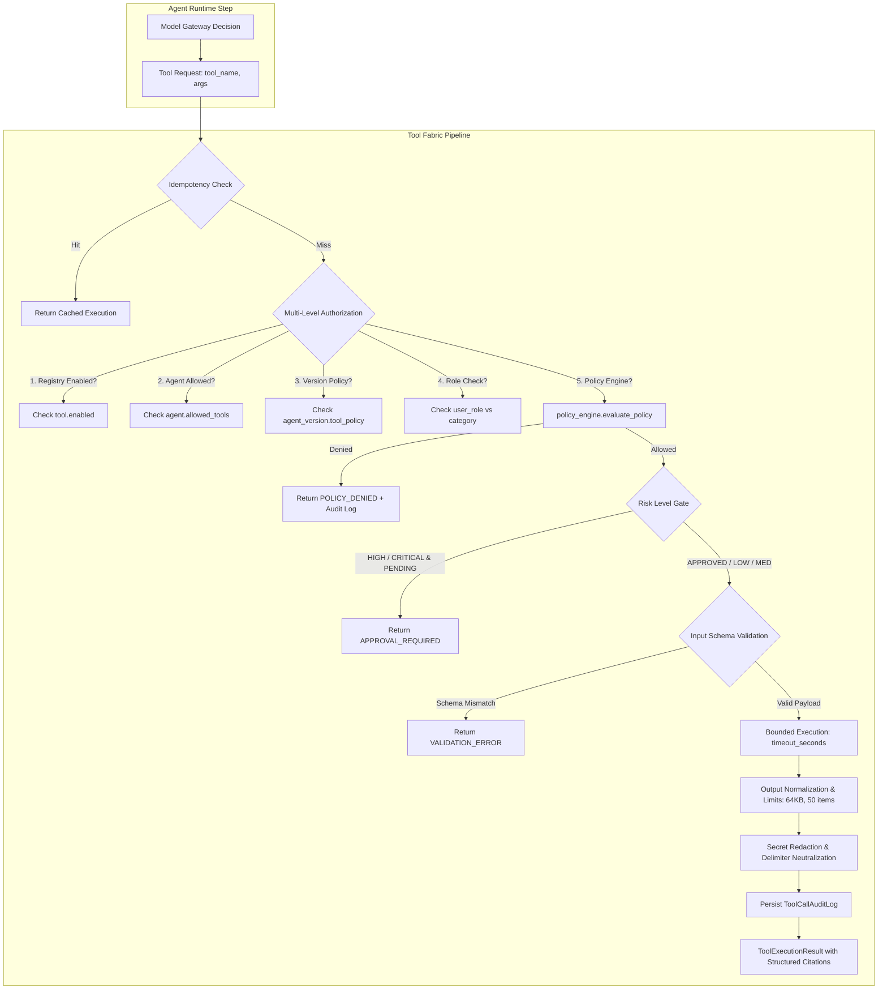
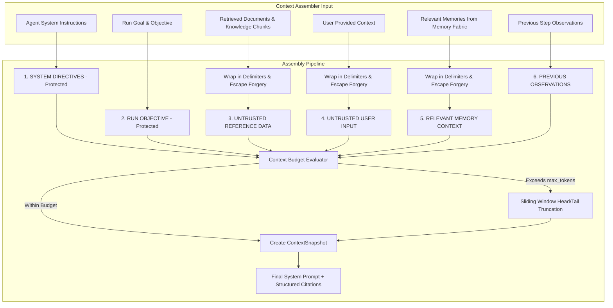

# KINETIQ Tool Fabric & Context/Memory Fabric V1 Architecture Report

## 1. Executive Summary

The **KINETIQ Tool Fabric & Context/Memory Fabric V1** establishes the mission-critical, governed data and capability plane directly beneath the Autonomous Agent Runtime. It enforces the foundational architecture principle of KINETIQ enterprise AI:

> *"The model can propose. The policy engine decides. The tool fabric controls capabilities. The context fabric controls what the model can know. The runtime controls what actually executes. Nothing should bypass these boundaries."*

By strictly preventing direct database access by LLMs, eliminating credential leakage to client applications, enforcing multi-level role-based authorization, quarantining untrusted retrieval content with unforgeable boundary tokens, and capturing reproducible execution context snapshots, the system provides zero-trust agentic autonomy with mathematical auditability.

---

## 2. Tool Fabric Architecture



### Key Tool Fabric Guarantees:
1. **Centralized Registry & Real Service Integration**: All 16 registered tools connect to production services (`drive_service`, `knowledge_service`, `memory_service`, `mission_service`, `workspace_service`, `content_service`, `workflow_engine`, `calendar_service`, `gmail_service`).
2. **Deterministic Risk Gates**:
   - `LOW` / `MEDIUM`: Autonomous execution within capability whitelist.
   - `HIGH` / `CRITICAL`: Bounded by execution approval status (`APPROVAL_REQUIRED` if unapproved).
3. **Idempotent Execution**: Caches results keyed on `idempotency_key` or `context.idempotency_key`, preventing duplicate side effects across agent retries.
4. **Bounded Timeouts**: Hard execution deadline (default 30s) aborts hanging tool calls and raises `TOOL_TIMEOUT`.
5. **Output Normalization**: Truncates oversized tool payloads (> 50 items or > 64KB text) with explicit `truncated: True` flags.
6. **Zero-Trust Audit Logging**: Records every executed, denied, or timed-out tool call with sanitized inputs where passwords, tokens, and API keys are strictly redacted to `[REDACTED]`.

---

## 3. Registered Tool Catalog (16 Standard Tools)

| Tool ID | Name | Category | Risk Level | Required Permissions | Description |
| :--- | :--- | :--- | :--- | :--- | :--- |
| `tool_search_documents` | `search_documents` | `SEARCH` | `LOW` | `["read"]` | Search authorized workspace files in Google Drive. |
| `tool_read_document` | `read_document` | `READ` | `LOW` | `["read"]` | Extract clean text from authorized workspace documents. |
| `tool_search_knowledge` | `search_knowledge` | `SEARCH` | `LOW` | `["read"]` | Search semantic knowledge chunks and entity graph. |
| `tool_search_memory` | `search_memory` | `SEARCH` | `LOW` | `["read"]` | Search approved long-term memories with relevance scoring. |
| `tool_get_mission` | `get_mission` | `READ` | `LOW` | `["read"]` | Retrieve mission goal, active steps, and progress. |
| `tool_get_workspace_context` | `get_workspace_context` | `READ` | `LOW` | `["read"]` | Retrieve workspace settings, tier, and member counts. |
| `tool_create_content` | `create_content` | `CONTENT` | `MEDIUM` | `["write"]` | Draft content assets in Content Studio. |
| `tool_trigger_workflow` | `trigger_workflow` | `WORKFLOW` | `HIGH` | `["write"]` | Trigger automated workflow DAG execution (Requires approval). |
| `tool_search_missions` | `search_missions` | `SEARCH` | `LOW` | `["read"]` | Search workspace missions by status or keyword. |
| `tool_create_mission` | `create_mission` | `DATA` | `MEDIUM` | `["write"]` | Create a new workspace mission draft. |
| `tool_create_memory_candidate` | `create_memory_candidate` | `DATA` | `MEDIUM` | `["write"]` | Propose memory candidate with provenance for user review. |
| `tool_get_calendar_events` | `get_calendar_events` | `READ` | `LOW` | `["read"]` | Retrieve upcoming calendar events. |
| `tool_create_calendar_event` | `create_calendar_event` | `COMMUNICATION`| `HIGH` | `["write"]` | Schedule calendar event (External side-effect, requires approval). |
| `tool_search_gmail` | `search_gmail` | `SEARCH` | `LOW` | `["read"]` | Search read-only email metadata in Gmail integration. |
| `tool_get_deliverables` | `get_deliverables` | `READ` | `LOW` | `["read"]` | Retrieve approved deliverables for a mission. |
| `tool_generate_insight` | `generate_insight` | `DATA` | `LOW` | `["read"]` | Generate strategic insight metrics. |

---

## 4. Context & Memory Fabric Architecture

### Context Assembly & Prompt Injection Quarantine



### Security Defenses:
1. **Delimiter Quarantine**: All untrusted external text is enclosed in:
   ```text
   === UNTRUSTED_RETRIEVED_DATA [Source: document_name] ===
   <content>
   === END_UNTRUSTED_RETRIEVED_DATA ===
   ```
2. **Delimiter Forgery Neutralization**: Any substring attempting to forge boundary tokens within document text is rewritten to `== [ESCAPED_DATA_TOKEN]`.
3. **Structured Citations**: Every piece of retrieved data builds a `CitationItem` `{source_type, source_id, title, snippet, workspace_id, confidence}`.
4. **Reproducible Snapshots**: Captures a point-in-time snapshot (`ContextSnapshot`) with all source IDs, token metrics, and policy versions for deterministic execution replay.
5. **Memory Fabric Tiers**:
   - `EPISODIC`: Specific past mission executions and step outcomes.
   - `SEMANTIC`: Workspace facts, domain knowledge, and definitions.
   - `PROCEDURAL`: Workflows, tool recipes, and operational steps.
   - `WORKING`: Short-term state and in-flight variables.

---

## 5. API Surface

| Method | Endpoint | Description |
| :--- | :--- | :--- |
| `GET` | `/api/v1/tools` | List registered tools with category filtering |
| `GET` | `/api/v1/tools/{tool_id}` | Get specific tool definition, schema, and risk level |
| `GET` | `/api/v1/tools/agents/{agent_id}/tools` | Capability-aware tool discovery (authorized vs denied) |
| `GET` | `/api/v1/tools/audit-logs` | Retrieve tool execution audit logs with secret redaction |
| `POST` | `/api/v1/context/preview` | Preview assembled prompt, token budget, and citations |
| `GET` | `/api/v1/context/snapshots/{agent_run_id}` | Retrieve reproducible context snapshot |
| `POST` | `/api/v1/memory/search` | Relevance-based memory retrieval across workspace |
| `POST` | `/api/v1/memory` | Create structured memory with provenance tracking |
| `GET` | `/api/v1/memory/{id}` | Retrieve single memory by ID with tenant check |
| `DELETE`| `/api/v1/memory/{id}` | Delete memory record within workspace |

---

## 6. Comprehensive Verification Suite (100% Passed)

### Backend Pytest Results:
All **41 / 41 automated tests passed** across all 4 core test suites:
- `apps/api/tests/test_tool_context_fabric_v1.py` (12/12 PASSED)
- `apps/api/tests/test_agent_runtime_v1.py` (12/12 PASSED)
- `apps/api/tests/test_mission_engine_v1.py` (10/10 PASSED)
- `apps/api/tests/test_model_gateway.py` (7/7 PASSED)

### Test Coverage Highlights:
- `test_cross_tenant_memory_access`: Verified Workspace A agent cannot search, fetch, or delete Workspace B memories.
- `test_cross_tenant_document_and_tool_access`: Verified Workspace A cannot read documents belonging to Workspace B.
- `test_unauthorized_tool_policy_denial`: Verified tool calls outside `allowed_tools` are rejected with `POLICY_DENIED`.
- `test_disabled_tool_rejection`: Verified disabled tools fail with `TOOL_DISABLED`.
- `test_capability_aware_tool_discovery`: Verified agent discovery returns only authorized tools and lists denied tools.
- `test_high_risk_approval_gate`: Verified high-risk tools block execution until approval is granted.
- `test_idempotency_side_effects`: Verified identical idempotency keys return cached execution without duplicate mutations.
- `test_tool_timeout_handling`: Verified slow tools are aborted after bounded timeout with `TOOL_TIMEOUT`.
- `test_oversized_tool_output_truncation`: Verified large outputs are truncated to 50 items / 64KB with `truncated: True`.
- `test_prompt_injection_quarantine`: Verified malicious boundary injection is neutralized.
- `test_memory_provenance_and_citations`: Verified memory provenance and context snapshot generation.
- `test_tool_audit_logging`: Verified audit logs record sanitized payloads with credential redaction.

### Frontend Web Build:
- **Command**: `pnpm --filter vapor-web build`
- **Result**: Successfully compiled 98/98 static and dynamic routes with **0 type errors** and **0 lint errors**.

---

## 7. Frontend User Experience Upgrades

1. **Governed Tool Catalog & Discovery Modal** (`apps/web/src/components/agents/AgentLibrary.tsx`):
   - Interactive modal listing permitted vs restricted tools for each agent.
   - Category badges (`SEARCH`, `READ`, `DATA`, `CONTENT`, `COMMUNICATION`, `WORKFLOW`).
   - Risk level pills (`LOW`, `MEDIUM`, `HIGH`, `CRITICAL`) with execution approval requirement warnings.
   - Timeout and permission indicators.
2. **Context Assembler Preview Modal** (`apps/web/src/components/agents/AgentLibrary.tsx`):
   - Real-time token budget progress bar with overflow warnings.
   - Inspector for structured context sections (`SYSTEM POLICY`, `RUN OBJECTIVE`, `QUARANTINED UNTRUSTED DATA`, `MEMORY`).
   - Governed citations viewer with confidence scoring.
3. **Execution Trace Workspace Upgrades** (`apps/web/src/components/agents/ExecutionTraceWorkspace.tsx`):
   - **Tool Audit Logs Tab**: Displays every tool execution with duration, status, risk level, sanitized inputs (secrets redacted), outputs, and truncation flags.
   - **Context Snapshot Tab**: Displays reproducible context snapshot ID, policy versions, referenced memory/document IDs, and token estimates.
